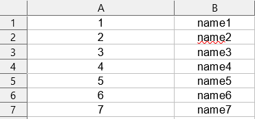

### Table of contents

- [ExcelImporterBundle](#excelimporterbundle)
  * [Installation](#installation)
  * [Documentation](#documentation)
    + [Sample import model- @ExcelColumn annotation:](#sample-import-model---excelcolumn-annotation-)
    + [Sample import - model (Technical keys):](#sample-import---model--technical-keys--)
    + [Sample import - model (Named column keys):](#sample-import---model--named-column-keys--)
    + [Sample import - display model](#sample-import---display-model)
    + [Sample import](#sample-import)
    + [Sample import - complex validation](#sample-import---complex-validation)
    + [Sample import- useful methods](#sample-import--useful-methods)
    + [Sample import- annotation validation](#sample-import--annotation-validation)
    + [Sample export](#sample-export)
    + [AbstractDictionaryExcelCell](#abstractdictionaryexcelcell)
    + [Yaml configuration](#yaml-configuration)

# ExcelImporterBundle

ExcelImportedBundle enables PHP objects import from EXCEL files as well as export of the same objects.

## Installation
You can install it with composer like so:

```bash
composer require kczer/excel-importer-bundle
```


## Documentation

### Sample import model- @ExcelColumn annotation:

First, we need to create model that will represent EXCEL file content. Here we use **@ExcelColumn** annotation with following options:

- **columnKey** (Supports translate keys): can be Technical EXCEL column name (in A-ZZZ... notation) or **Named column name** (recommended) that will be value in EXCEL file.
For named column names to work we need to have one row that matches all column names.
Named and technical column keys must not be mixed.

- **cellName** (Supports translate keys): Name that is used for displaying error messages and also can be used for displaying straight from ExcelRow instance. 
- **targetExcelCellClass**: Excel cell klas that will be used to parse excel value to property. Several of them are available out of the box:

  | Syntax                      | Description                                                                                                                                              | Returned | Default validation                                                                                                                                  | Configuration                                                                                                                                              |
  |-----------------------------|----------------------------------------------------------------------------------------------------------------------------------------------------------|----------|-----------------------------------------------------------------------------------------------------------------------------------------------------|------------------------------------------------------------------------------------------------------------------------------------------------------------|
  | StringExcelCell             | Basic type for handling simple string                                                                                                                    | string   | None                                                                                                                                                | none                                                                                                                                                       |
  | IntegerExcelCell            | Type for handling integer values                                                                                                                         | int      | EXCEL value needs to be valid int                                                                                                                   | none                                                                                                                                                       |
  | FloatExcelCell              | Type for handling float values                                                                                                                           | float    | EXCEL value needs to be number                                                                                                                      | none                                                                                                                                                       |
  | BoolExcelCell               | Type for handling bool values                                                                                                                            | bool     | Value needs to be one of ['tak', 'y', 'yes', 't', 't', 'true', '1'] for true, or ['nie', 'n', 'no', 'false', 'f', '0'] for false (case insensitive) | true and false values are configurable, as well as option to treat empty values as false  (more info in [yaml configuration](#yaml-configuration) section) |
  | DateTimeExcelCell           | Type for handling dates or dates with time                                                                                                               | DateTime | Value needs to be acceptable by DateTime class constructor                                                                                          | none                                                                                                                                                       |
  | AbstractDictionaryExcelCell | Type for handling EXCEL values that can be only in specified range (each dictionary excel cell needs to be created by extending AbstractExcelCell class) | mixed    | Value needs to be a key from dictionary (more info in [AbstractDictionaryExcelCell](#abstractdictionaryexcelcell) section)                          | none                                                                                                                                                       |

- **required**: Whether the value is required in the EXCEL file (default to true)
- **options**: additional options specific for EXCEL cell. Supported options:

  | EXCEL cell class  | option                | description                                      |
  |-------------------|-----------------------|--------------------------------------------------|
  | DateTimeExcelCell | reverseDateTimeFormat | Format used for EXCEL export of related property |

### Sample import - model (Technical keys):

Sample model for EXCEL file would look like this:

```php
<?php
//TestModel.php

use Kczer\ExcelImporterBundle\Annotation\ExcelColumn;
use Kczer\ExcelImporterBundle\ExcelElement\ExcelCell\StringExcelCell;
use Kczer\ExcelImporterBundle\ExcelElement\ExcelCell\IntegerExcelCell;

class TestModel
{
    /**
     * @ExcelColumn(columnKey="A", cellName="id", targetExcelCellClass=IntegerExcelCell::class)
     *
     * @var int
     */
    private $id;

    /**
     * @ExcelColumn(columnKey="B", cellName="name", targetExcelCellClass=StringExcelCell::class, required=false)
     *
     * @var string|null
     */
    private $name;

     // Model class MUST have public getters and setters for mapped properties
     // to let importer prepare the model
    public function getId(): int
    {
        return $this->id;
    }

    public function setId(int $id): self
    {
        $this->id = $id;
        
        return $this;
    }

    public function getName(): ?string
    {
        return $this->name;
    }

    public function setName(?string $name): self
    {
        $this->name = $name;
        
        return $this;
    }
}
```

Following EXCEL file would match this model:



### Sample import - model (Named column keys):

The same model as above using named column keys would look like so:

```php
<?php
//TestModel.php

use Kczer\ExcelImporterBundle\Annotation\ExcelColumn;
use Kczer\ExcelImporterBundle\ExcelElement\ExcelCell\StringExcelCell;
use Kczer\ExcelImporterBundle\ExcelElement\ExcelCell\IntegerExcelCell;

class TestModel
{
    // column key can be also a translation key
    /**
     * @ExcelColumn(columnKey="id", cellName="id", targetExcelCellClass=IntegerExcelCell::class)
     *
     * @var int
     */
    private $id;

    /**
     * @ExcelColumn(columnKey="name", cellName="name", targetExcelCellClass=StringExcelCell::class, required=false)
     *
     * @var string|null
     */
    private $name;

     // Model class MUST have public getters and setters for mapped properties
     // to let importer prepare the model
    public function getId(): int
    {
        return $this->id;
    }

    public function setId(int $id): self
    {
        $this->id = $id;
        
        return $this;
    }

    public function getName(): ?string
    {
        return $this->name;
    }

    public function setName(?string $name): self
    {
        $this->name = $name;
        
        return $this;
    }
}
```

### Sample import - display model

Sometimes we would like to display some of imported content or see validation messages generated by importer. 
It can be achieved by creating display model class that extends **AbstractDisplayModel** class.
Display model classes must have the same property names as model one (for all mapped fields) and have them declared as strings.
Display model class for above model would look like so:

```php
<?php
//TestModel.php

use Kczer\ExcelImporterBundle\Annotation\ExcelColumn;
use Kczer\ExcelImporterBundle\ExcelElement\ExcelCell\StringExcelCell;
use Kczer\ExcelImporterBundle\ExcelElement\ExcelCell\IntegerExcelCell;
use \Kczer\ExcelImporterBundle\Model\AbstractDisplayModel;

class TestDisplayModel extends AbstractDisplayModel
{
    /** @var string */
    private $id;

    /** @var string */
    private $name;


    public function getId(): string
    {
        return $this->id;
    }

    public function setId(string $id): self
    {
        $this->id = $id;
        
        return $this;
    }

    public function getName(): string
    {
        return $this->name;
    }

    public function setName(string $name): self
    {
        $this->name = $name;
        
        return $this;
    }
}
```

Thanks to extending **AbstractDisplayModel** class we have access to two methods:
- isValid: Returns true or false depending on model validity  
- getMergedAllErrorMessages: Returns string containing concatenated error messages from all properties of model

### Sample import 

Model defined above can be imported via importing **ModelExcelImporterFactory** and creating **ModelExcelImporter** instance 

```php
<?php
//TestService.php

use \Kczer\ExcelImporterBundle\Importer\Factory\ModelExcelImporterFactory;

class TestService
{
    /** @var ModelExcelImporterFactory */
    private $modelExcelImporterFactory;
    
    public function __construct(ModelExcelImporterFactory $modelExcelImporterFactory)
    {
        $this->modelExcelImporterFactory = $modelExcelImporterFactory
    }
    
    /**
    * @return TestModel[]
    */
    public function getImportedModels(string $excelFilePath): array
    {
        $importer = $this->modelExcelImporterFactory->createModelExcelImporter(TestModel::class, TestDisplayModel::class); //Display model class can be null if not needed
        $importer->parseExcelFile($excelFilePath);
        
        return $importer->getModels(); //$importer->getDisplayModels() for display models
    }
}
```

Method **parseExcelFile** takes up two arguments:
- excelFilePath: full path to EXCEL file
- firstRowMode (optional, works only with technical column keys): Tells what importer should do with first data row. Available options:
  - AbstractExcelImporter::FIRST_ROW_MODE_SKIP(default): skip first data row
  - AbstractExcelImporter::FIRST_ROW_MODE_DONT_SKIP: do not skip first data row
  - AbstractExcelImporter::FIRST_ROW_MODE_SKIP_IF_INVALID: skip first data row only if it is not valid against model

### Sample import - complex validation

Sometimes it is required to perform some more complex validation, for example validation between columns, when one cell should be dependent on others.
Let's say that we want every name cell to end with corresponding id.
It is achievable by calling **setRowRequirementsValidator**:

```php
<?php
//TestService.php

use \Kczer\ExcelImporterBundle\Importer\Factory\ModelExcelImporterFactory;
use \Kczer\ExcelImporterBundle\ExcelElement\ExcelRow;
use function substr;
use function strlen;

class TestService
{
    /** @var ModelExcelImporterFactory */
    private $modelExcelImporterFactory;
    
    public function __construct(ModelExcelImporterFactory $modelExcelImporterFactory)
    {
        $this->modelExcelImporterFactory = $modelExcelImporterFactory
    }
    
    /**
    * @return TestModel[]
    */
    public function getImportedModels(string $excelFilePath): array
    {
        $importer = $this->modelExcelImporterFactory->createModelExcelImporter(TestModel::class, TestDisplayModel::class); //Display model class can be null if not needed
        $importer->setRowRequirementsValidator([$this, 'validateRowRequirements']);//Or with standard anonymous function syntax
        $importer->parseExcelFile($excelFilePath);
        
        return $importer->getModels();
    }
    
    public function validateRowRequirements(ExcelRow $excelRow): void
    {
        $excelCells = $excelRow->getExcelCells(); // Array of ExcelCell objects, keys are column keys (technical or named: named in example)
        $idString = (string)$excelCells['id']->getValue(); // Already parsed value; $excelCells['id']->getRawValue() for string|null
        if ($idString !== substr($excelCells['name']->getValue(), -1 * strlen($idString))) {
            $excelRow->addErrorMessage('Name should end with the corresponding id'); // Supports translation keys
        }
    }
}
```

### Sample import- useful methods

Here are some useful methods from importer:

```php
<?php
//TestService.php

use \Kczer\ExcelImporterBundle\Importer\Factory\ModelExcelImporterFactory;
use \Kczer\ExcelImporterBundle\Importer\ModelExcelImporter;

class TestService
{
    /** @var ModelExcelImporter */
    private $modelExcelImporter;
    
    //.
    //.
    //.
   
   public function foo(): void
   {
        $this->modelExcelImporter->getExcelRowsAsJson(); // Get imported as JSON
        $this->modelExcelImporter->parseJson(); // Import JSON back to models
        $this->modelExcelImporter->hasErrors(); // Are there any validation errors in EXCEL file?
   }
}
```

### Sample import- annotation validation

Bundle comes with two built-in validation available from model level:
- **@Validator\Regex**: Validates excel cell value against regex expression (regex is case insensitive)
- **@Validator\Length**: Validates excel cell length

Each validator has _message_ property, that specifies error message when validation fails.
These messages support translations and each validator passes specific translation parameters. Supported translation parameters
- **@Validator\Regex**:
  - %pattern%: pattern passed in annotation
- **@Validator\Length**: 
  - %minLength%: minimum length passed in annotation
  - %maxLength%: maximum length passed in annotation 

If we for example wanted name field to always end with id, and to be at most 10 characters long, we can type:

```php
<?php
//TestModel.php

use Kczer\ExcelImporterBundle\Annotation\ExcelColumn;
use Kczer\ExcelImporterBundle\ExcelElement\ExcelCell\StringExcelCell;
use Kczer\ExcelImporterBundle\ExcelElement\ExcelCell\IntegerExcelCell;
use Kczer\ExcelImporterBundle\Annotation\Validator;

class TestModel
{
     // .
     // .
     // .
     
    /**
     * @ExcelColumn(columnKey="name", cellName="name", targetExcelCellClass=StringExcelCell::class, required=false)
     * @Validator\Regex(pattern="[a-z]+\d+", message="Name must end with the id") In case of error adds message "Name must end with the id" to cell errors
     * @Validator\Length(maxLength=10) In case of error adds message "Value's max length is 10" to cell errors
     * 
     * @var string|null
     */
    private $name;

     // .
     // .
     // .
}
```

```php
<?php
//TestModel.php

use Kczer\ExcelImporterBundle\Annotation\ExcelColumn;
use Kczer\ExcelImporterBundle\ExcelElement\ExcelCell\StringExcelCell;
use Kczer\ExcelImporterBundle\ExcelElement\ExcelCell\IntegerExcelCell;

class TestModel
{
    // column key can be also a translation key
    /**
     * @ExcelColumn(columnKey="id", cellName="id", targetExcelCellClass=IntegerExcelCell::class)
     *
     * @var int
     */
    private $id;

    /**
     * @ExcelColumn(columnKey="name", cellName="name", targetExcelCellClass=StringExcelCell::class, required=false)
     *
     * @var string|null
     */
    private $name;

     // Model class MUST have public getters and setters for mapped properties
     // to let importer prepare the model
    public function getId(): int
    {
        return $this->id;
    }

    public function setId(int $id): self
    {
        $this->id = $id;
        
        return $this;
    }

    public function getName(): ?string
    {
        return $this->name;
    }

    public function setName(?string $name): self
    {
        $this->name = $name;
        
        return $this;
    }
}
```

### Sample export

Having our model we can not only import it from EXCEL file, but also export it and merge to existing EXCEL FILES.

```php
<?php
//TestExportService.php

use Kczer\ExcelImporterBundle\Exporter\ModelExcelExporter;

class TestExportService
{
    /** @var ModelExcelExporter */
    private $modelExcelExporter;
    
    //.
    //.
    //.
   
   /**
    * @param TestModel[] $models
    */
   public function exportModels(array $testModels, string $existingExcelFilePath): void
   {
        $newExcelFileTmpPath = $this->modelExcelExporter->exportModelsToNewFile($testModels); //Returns path to newly created TMP file
        $newMergedExcelFileTmpPath = $this->modelExcelExporter->exportAndMergeModelsToExistingFile($testModels, $existingExcelFilePath)
   }
}
```

There are two export methods:
- **exportModelsToNewFile**: Create new EXCEL file and output models to it. Method takes up to three arguments
  - models: Models to export
  - newFileNameWithoutExtension: Generated EXCEL file name without extension. random name if null provided
  - outputHeaders: Whether to add header columns
- **exportAndMergeModelsToExistingFile**: Create new EXCEL file and output models to it. Method takes up to three arguments
  - models: Same as above
  - newFileNameWithoutExtension: Same as above
  - comparer: Can be either model property name to compare or anonymous function taking two models as arguments that returns bool if 
two models are equal. If two models are equal, the EXCEL one will be replaced with imported one
  - firstRowMode: first row mode passed to importer when getting data from EXCEL (works only with technical column keys)

### AbstractDictionaryExcelCell

Dictionary EXCEL cells are used to define "range" of values, that cell can take.
It's use when cell value must match some column value from database
Sample DictionaryClass class:

```php
<?php

class SampleDictionaryExcelCell extends AbstractDictionaryExcelCell
{
    /** @var TestRepository */
    private $testRepository;
    
    public function __construct(TestRepository $testRepository)
    {
        $this->myRepository = $testRepository;
    }

    /**
     * @inheritDoc
     */
    protected function getDictionary(): array
    {
       return $this->testRepository->findIndexedBySomeUniqeCode(); // array in format ['some code expected in excel' => $valueInExcel, ...]
    }
}
```

### Yaml configuration

Example below shows all available configuration options, that can be paced in _config/packages/kczer_excel_importer.yaml_ file:

```yaml
kczer_excel_importer:
  excel_cell:
    bool: # BoolExcelCell Configuration
      empty_as_false: false # Treat empty values as false? (default to true)
      true_values: # Values that override default true values
        - absolutely
        - of course
        - ofc
      false_values: # Values that override default false values
        - absolutely not
        - of course not
        - ofcn
```